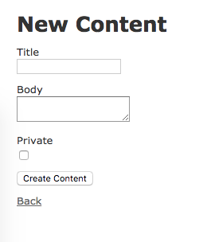

# railsHerokuScaffold

railsで作った動的アプリをHerokuに乗せるまでのよくやる設定

- 雛形作成

```
$ APP_NAME=railsHerokuScaffold
$ rails new ${APP_NAME}
$ cd ${APP_NAME}
$ git add -A
$ git commit -m 'rails new'
```

- scaffold

```
$ rails g scaffold content title:string body:text private:boolean
$ rails db:migrate
```

- routes編集

config/routes.rb

2行目に追加

```
root 'contents#index'
```

- スマホ対応

app/views/layouts/application.html.erb

headerタグ内に追加

```
<meta name="viewport" content="width=device-width, initial-scale=1">
```

- herokuで使用するDBをpostgresに変更

※ローカルで使用するDBはsqliteのままにする

Gemfile

```
# Use sqlite3 as the database for Active Record
gem 'sqlite3'
```

↓

```
# Use sqlite3 as the database for Active Record
gem 'sqlite3', group: :development
# 本番ではpostgressを使用する
gem 'pg', group: :production
```

- ローカルでの動作確認

```
$ rails s
$ open http://0.0.0.0:3000
```

この画面が表示されたら成功





- コミット&デプロイ

```
$ git add -A
$ git commit -m 'add root page'

$ APP_NAME_HEROKU=yf-rails-heroku-start
$ heroku create ${APP_NAME_HEROKU}
$ git push heroku master
```

- 動作確認

```
$ heroku open

or

$ open https://${APP_NAME_HEROKU}.herokuapp.com/
```